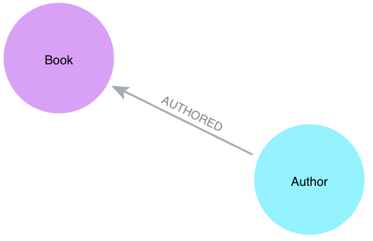

= Neo4j on Kubernetes

This is an example project to run Neo4j on Kubernetes, and also includes a Spring Boot backend service to interact with the Neo4j database.

== Data set

Data is maintained and pulled from a public data source. Load scripts and more information is available in https://github.com/JMHReif/graph-demo-datasets/tree/main/goodreadsUCSD[this data set Github repository^]. An example of the data model is shown below.

== Config and setup

The `my-neo4j.values.yaml` file contains the configuration for the Neo4j Helm chart. The `deployment.yaml` file contains the configuration for the Spring Boot service. Sample files for each are included in this repository.

You will need to fill in the Neo4j credential values.

== Running and testing this project

To run the project, you will need to have a Kubernetes cluster running. You can use Minikube, Docker Desktop (what I used), or any other Kubernetes cluster you have access to.

[source,shell]
----
# Spin up Neo4j on Kubernetes
helm install my-neo4j-release neo4j/neo4j --namespace neo4j -f my-neo4j.values.yaml
# Deploy the Spring Boot service
kubectl apply -f deployment.yaml

# Check the status of the deployments
kubectl get all
----

You can check the data in the database by opening a Browser tab to the Neo4j Browser at http://localhost:7474/.

To test the Spring Boot application service, you can use the following commands:

[source,shell]
----
http :30080/hello
http :30080/authors/Stephen%20King
http :30080/authors/Jane%20Austen
http :30080/authors/J%2ER%2ER%2E%20Tolkien
http :30080/authors/J%2EK%2E%20Rowling
http :30080/authors/Timothy%20Zahn
----

*Note:* The above commands are using the https://httpie.io/[
HTTPie^] command line tool, but you can use `curl` similarly.

== Shutting down

Run the following commands to shut down the Neo4j cluster and the application.

[source,shell]
----
# Shut down cluster
helm uninstall my-neo4j-release
# Delete the application deployment
kubectl delete deploy kube-neo4j-books

# Not required unless wanting to clean up resources
kubectl delete pvc --all --namespace neo4j
----

== Presentation

_Coming soon!_

== Resources
* Deploy Kubernetes with Docker Desktop: https://docs.docker.com/desktop/kubernetes/
* Quickstart Neo4j docs: https://neo4j.com/docs/operations-manual/current/kubernetes/quickstart-standalone/
* Diagram for deploying Neo4j on Kubernetes: https://neo4j.com/docs/operations-manual/current/kubernetes/quickstart-standalone/server-setup/
* Guide to deploy SB app to Kubernetes: https://spring.io/guides/gs/spring-boot-kubernetes